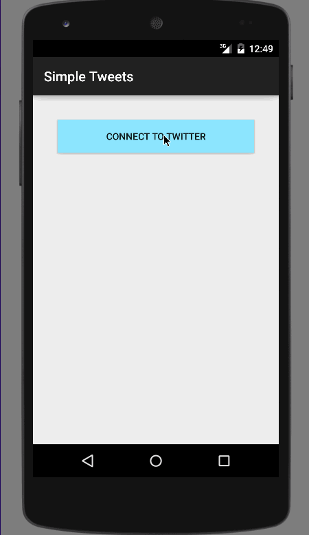

# Twitter-with-Fragments
Twitter client using a tabbed interface and fragments.

-User can switch between Timeline and Mention views using tabs. 
    &nbsp;&nbsp; User can view their home timeline tweets. 
    &nbsp;&nbsp; User can view the recent mentions of their username. 
-User can navigate to view their own profile. 
    &nbsp;&nbsp; User can see picture, tagline, # of followers, # of following, and tweets on their profile. 
-User can click on the profile image in any tweet to see another user's profile. 
    &nbsp;&nbsp; User can see picture, tagline, # of followers, # of following, and tweets of clicked user. 
    &nbsp;&nbsp; Profile view should include that user's timeline. 
-User can infinitely paginate any of these timelines (home, mentions, user) by scrolling to the bottom. 

Walk through of user stories:

GIF created with [LiceCap](http://www.cockos.com/licecap/).

